# UI カタログ（画面一覧とスクリーンショット対応表）

Expo Web（`app-expo`）の画面を Playwright（`e2e-web`）で巡回して取得したスクリーンショットと、画面名 / URL / 遷移関係の対応表です。

- 生成日時: 2026-08-10T10:46:32.548Z
- 定義済み画面（UI 状態を含む）: 46 件
- 自動取得の対象: 37 件（うち取得済み 36 件）
- 自動取得の対象外（実データ ID や外部 IdP が必要）: 9 件

> 画面定義の唯一の情報源は `e2e-web/catalog/screens.json` です。
> スクリーンショットのファイル名は必ず `<画面 ID>.png` で、公開 URL だけを見ても画面が分かります。

<!-- このファイルは自動生成です。手で編集せず、定義とスクリプトを更新してください。 -->

再生成:

```bash
pnpm --filter e2e-web test:catalog   # スクリーンショットを撮り直す（要 dev ビルド + 実 API）
pnpm --filter e2e-web catalog:doc    # 画面一覧を生成する（screenshots/UI_CATALOG.md）
```

GitHub Actions では `E2E Web Test` を `capture_ui_catalog = true` で手動実行すると、スクリーンショット一式が Artifact `ui-catalog-screenshots` として保存されます。その run を `Evidence Collect` に渡すと GCS へ公開され、画面名がそのまま入った公開 URL が manifest に出ます。

この一覧の公開 URL は、次の run で取得・公開されたスクリーンショットを指しています。

- 取得元 run: https://github.com/Ayato-kosaka/nanitabeyo/actions/runs/31379921574
- 対象 commit: `9c37e34e1b9b973fd5895fe9c3eb6b925dda60ce`
- 公開先（GCS）: `gs://nanitabeyo-public/e2e-evidence/Ayato-kosaka/nanitabeyo/runs/31379921574/ui-catalog-screenshots`
- manifest: https://storage.googleapis.com/nanitabeyo-public/e2e-evidence/Ayato-kosaka/nanitabeyo/runs/31379921574/ui-catalog-screenshots/manifest.json

## 画面一覧（自動取得）

| 画面名                                     | URL / Route                                                                                                                       | スクリーンショット                                   | 公開 URL                                                                                                                                                                                 | 説明                                                                                                                 | 遷移元                                                                                   | 主な遷移先                                                                                                | 同一 URL 内の UI 状態                                                                                    | 取得状況             |
| ------------------------------------------ | --------------------------------------------------------------------------------------------------------------------------------- | ---------------------------------------------------- | ---------------------------------------------------------------------------------------------------------------------------------------------------------------------------------------- | -------------------------------------------------------------------------------------------------------------------- | ---------------------------------------------------------------------------------------- | --------------------------------------------------------------------------------------------------------- | -------------------------------------------------------------------------------------------------------- | -------------------- |
| 検索フォーム（さがすタブ）                 | `/ja-JP/search`<br>`/[locale]/search`                                                                                             | `search-form.png`                                    | [画像](https://storage.googleapis.com/nanitabeyo-public/e2e-evidence/Ayato-kosaka/nanitabeyo/runs/31379921574/ui-catalog-screenshots/search-form.png)                                    | アプリの起動直後に表示される既定タブ。場所・時間帯・シーンを指定して料理を検索する入口。                             | 起動（/ → /[locale] へロケールリダイレクト） / タブバー「さがす」 / 料理提案画面から戻る | 料理提案（検索実行） / レビュータブ / マイページタブ                                                      | —                                                                                                        | 取得済み（公開済み） |
| 検索フォーム（詳細条件を展開）             | `/ja-JP/search`<br>`/[locale]/search`                                                                                             | `search-form-advanced-open.png`                      | [画像](https://storage.googleapis.com/nanitabeyo-public/e2e-evidence/Ayato-kosaka/nanitabeyo/runs/31379921574/ui-catalog-screenshots/search-form-advanced-open.png)                      | 同一 URL 内の UI 状態。検索条件の詳細（距離・予算・味/主素材の系統など）を展開したところ。                           | 検索フォーム                                                                             | 料理提案（検索実行）                                                                                      | 詳細条件トグル（search-advanced-toggle）を開いた状態。距離スライダー・予算・食べたい系統などが表示される | 取得済み（公開済み） |
| 検索フォーム（場所サジェスト表示）         | `/ja-JP/search`<br>`/[locale]/search`                                                                                             | `search-form-location-suggestions.png`               | [画像](https://storage.googleapis.com/nanitabeyo-public/e2e-evidence/Ayato-kosaka/nanitabeyo/runs/31379921574/ui-catalog-screenshots/search-form-location-suggestions.png)               | 同一 URL 内の UI 状態。Google Places 由来の場所候補を選ぶと検索の必須項目「場所」が確定する。                        | 検索フォーム                                                                             | 検索フォーム（場所確定）                                                                                  | 場所入力欄に文字を入れ、オートコンプリートの候補リストが開いた状態                                       | 取得済み（公開済み） |
| 検索チュートリアル（BottomSheet）          | `/ja-JP/search`<br>`/[locale]/search`                                                                                             | `search-tutorial.png`                                | [画像](https://storage.googleapis.com/nanitabeyo-public/e2e-evidence/Ayato-kosaka/nanitabeyo/runs/31379921574/ui-catalog-screenshots/search-tutorial.png)                                | 同一 URL 内の UI 状態。ja-JP の初回訪問時のみ自動表示され、最終ページで現在地取得を促す。                            | 検索フォーム（初回訪問） / 検索フォームのヘルプボタン（？）                              | 検索フォーム                                                                                              | 初回訪問時に自動表示されるチュートリアル。ヘッダーの「？」からも再表示できる                             | 取得済み（公開済み） |
| 料理提案（トピックカード）                 | `/ja-JP/search/topics`<br>`/[locale]/search/topics`                                                                               | `search-topics.png`                                  | [画像](https://storage.googleapis.com/nanitabeyo-public/e2e-evidence/Ayato-kosaka/nanitabeyo/runs/31379921574/ui-catalog-screenshots/search-topics.png)                                  | 検索条件から生成された料理トピックのカルーセル。カードをスワイプして選び、「この料理にする！」で結果フィードへ進む。 | 検索フォーム（検索実行）                                                                 | 検索結果フィード（この料理にする！） / 検索フォーム（戻る） / みんなで投票（共有）                        | —                                                                                                        | 取得済み（公開済み） |
| 料理提案チュートリアル（スポットライト）   | `/ja-JP/search/topics`<br>`/[locale]/search/topics`                                                                               | `search-topics-tutorial.png`                         | [画像](https://storage.googleapis.com/nanitabeyo-public/e2e-evidence/Ayato-kosaka/nanitabeyo/runs/31379921574/ui-catalog-screenshots/search-topics-tutorial.png)                         | 同一 URL 内の UI 状態。スワイプ操作・深掘り・トピック操作・みんなで投票の順に案内する。                              | 料理提案（初回表示） / 料理提案のヘルプボタン（？）                                      | 料理提案                                                                                                  | 初回表示時のスポットライトチュートリアル（ヘッダーの「？」からも再表示可能）                             | 取得済み（公開済み） |
| 検索結果フィード（料理メディア）           | `/ja-JP/search/result`<br>`/[locale]/search/result`                                                                               | `search-result-feed.png`                             | [画像](https://storage.googleapis.com/nanitabeyo-public/e2e-evidence/Ayato-kosaka/nanitabeyo/runs/31379921574/ui-catalog-screenshots/search-result-feed.png)                             | 選んだ料理トピックに対する店舗・料理メディアの縦フィード。いいね／保存／店舗地図への導線を持つ。                     | 料理提案（この料理にする！）                                                             | 料理提案（閉じる＝戻る） / 店舗詳細・地図アプリ（外部）                                                   | —                                                                                                        | 取得済み（公開済み） |
| みんなで投票・結果                         | `/ja-JP/search/dish-category-group-votes/<shareToken>`<br>`/[locale]/search/dish-category-group-votes/[shareToken]`               | `search-group-vote-result.png`                       | [画像](https://storage.googleapis.com/nanitabeyo-public/e2e-evidence/Ayato-kosaka/nanitabeyo/runs/31379921574/ui-catalog-screenshots/search-group-vote-result.png)                       | 料理候補をグループで投票した結果を共有リンクで見る画面。候補の削除や再投票の導線を持つ。                             | 料理提案（みんなで投票の共有リンク） / 外部で共有された URL の直接オープン               | みんなで投票・投票画面                                                                                    | 共有トークンが無効な場合は読み込み失敗＋再試行ボタンの状態になる                                         | 取得済み（公開済み） |
| みんなで投票・投票                         | `/ja-JP/search/dish-category-group-votes/<shareToken>/vote`<br>`/[locale]/search/dish-category-group-votes/[shareToken]/vote`     | `search-group-vote-vote.png`                         | [画像](https://storage.googleapis.com/nanitabeyo-public/e2e-evidence/Ayato-kosaka/nanitabeyo/runs/31379921574/ui-catalog-screenshots/search-group-vote-vote.png)                         | 共有リンクを受け取った人が料理候補に投票する画面。Web で開かれた場合はアプリで開き直すバナーを出す。                 | みんなで投票・結果 / 外部で共有された URL の直接オープン                                 | みんなで投票・結果                                                                                        | 共有トークンが無効な場合は読み込み失敗＋再試行ボタンの状態になる                                         | 取得済み（公開済み） |
| レビュータブ（ゲスト）                     | `/ja-JP/review`<br>`/[locale]/review`                                                                                             | `review-guest.png`                                   | [画像](https://storage.googleapis.com/nanitabeyo-public/e2e-evidence/Ayato-kosaka/nanitabeyo/runs/31379921574/ui-catalog-screenshots/review-guest.png)                                   | レビュー投稿タブの未ログイン時表示。ログインするとレビュー投稿の導線に切り替わる。                                   | タブバー「レビュー」                                                                     | ログインモーダル                                                                                          | 匿名ユーザー向け。ログイン誘導のみでレビュー投稿の導線は出ない                                           | 取得済み（公開済み） |
| ログインモーダル（レビュータブ）           | `/ja-JP/review`<br>`/[locale]/review`                                                                                             | `review-guest-login-modal.png`                       | [画像](https://storage.googleapis.com/nanitabeyo-public/e2e-evidence/Ayato-kosaka/nanitabeyo/runs/31379921574/ui-catalog-screenshots/review-guest-login-modal.png)                       | 同一 URL 内の UI 状態。マイページから開くものと同一コンポーネント（LoginbackModal）。                                | レビュータブ（ゲスト）                                                                   | 外部 IdP（Google / Apple OAuth） / 利用規約・プライバシーポリシーのモーダル                               | BlurModal で表示されるログインモーダル（Google / Apple のみ）                                            | 取得済み（公開済み） |
| マイページ（ゲスト・保存した投稿）         | `/ja-JP/profile`<br>`/[locale]/profile`                                                                                           | `profile-guest.png`                                  | [画像](https://storage.googleapis.com/nanitabeyo-public/e2e-evidence/Ayato-kosaka/nanitabeyo/runs/31379921574/ui-catalog-screenshots/profile-guest.png)                                  | プロフィールタブ。匿名時はゲスト表示＋ログインボタンで、投稿・ウォレット系タブは出ない。                             | タブバー「マイページ」 / URL 直リンク                                                    | 設定 / ログインモーダル / 保存/いいねした投稿のフィード                                                   | 匿名ユーザー。タブは保存系（保存した投稿／保存したトピック／いいね）のみ                                 | 取得済み（公開済み） |
| マイページ（保存したトピック）             | `/ja-JP/profile`<br>`/[locale]/profile`                                                                                           | `profile-guest-saved-topics.png`                     | [画像](https://storage.googleapis.com/nanitabeyo-public/e2e-evidence/Ayato-kosaka/nanitabeyo/runs/31379921574/ui-catalog-screenshots/profile-guest-saved-topics.png)                     | 同一 URL 内の UI 状態。保存した料理トピックの一覧。                                                                  | マイページ                                                                               | 検索結果フィード（保存トピックから再検索）                                                                | プロフィール内タブ「保存したトピック」を選択した状態                                                     | 取得済み（公開済み） |
| マイページ（いいね）                       | `/ja-JP/profile`<br>`/[locale]/profile`                                                                                           | `profile-guest-liked.png`                            | [画像](https://storage.googleapis.com/nanitabeyo-public/e2e-evidence/Ayato-kosaka/nanitabeyo/runs/31379921574/ui-catalog-screenshots/profile-guest-liked.png)                            | 同一 URL 内の UI 状態。いいねした料理メディアの一覧。                                                                | マイページ                                                                               | 料理メディアフィード                                                                                      | プロフィール内タブ「いいね」を選択した状態                                                               | 取得済み（公開済み） |
| ログインモーダル（マイページ）             | `/ja-JP/profile`<br>`/[locale]/profile`                                                                                           | `profile-guest-login-modal.png`                      | [画像](https://storage.googleapis.com/nanitabeyo-public/e2e-evidence/Ayato-kosaka/nanitabeyo/runs/31379921574/ui-catalog-screenshots/profile-guest-login-modal.png)                      | 同一 URL 内の UI 状態。Google / Apple の OAuth ボタンとリーガルリンクを持つ。                                        | マイページ（ゲスト）                                                                     | 外部 IdP（Google / Apple OAuth） / 利用規約・プライバシーポリシーのモーダル                               | ログインボタン（profile-login-button）から開いた BlurModal                                               | 取得済み（公開済み） |
| 設定                                       | `/ja-JP/profile/settings`<br>`/[locale]/profile/settings`                                                                         | `profile-settings.png`                               | [画像](https://storage.googleapis.com/nanitabeyo-public/e2e-evidence/Ayato-kosaka/nanitabeyo/runs/31379921574/ui-catalog-screenshots/profile-settings.png)                               | 設定メニュー。フィードバック・ブロック済みトピック・各種リーガル文書への導線を持つ。                                 | マイページ（歯車アイコン） / URL 直リンク                                                | ご意見・不具合 / ブロック済みの料理トピック / 利用規約/プライバシーポリシー/ガイドライン/著作権のモーダル | 匿名ユーザー。ログアウト行は出ない（Web では「レビューを書く」も非表示）                                 | 取得済み（公開済み） |
| 利用規約（リーガルモーダル）               | `/ja-JP/profile/settings`<br>`/[locale]/profile/settings`                                                                         | `profile-settings-terms-modal.png`                   | [画像](https://storage.googleapis.com/nanitabeyo-public/e2e-evidence/Ayato-kosaka/nanitabeyo/runs/31379921574/ui-catalog-screenshots/profile-settings-terms-modal.png)                   | 同一 URL 内の UI 状態。Markdown のリーガル文書をモーダルで表示する（プライバシーポリシー等も同一コンポーネント）。   | 設定                                                                                     | 設定（閉じる）                                                                                            | 設定の「利用規約」から開く legal-document-modal                                                          | 取得済み（公開済み） |
| プライバシーポリシー（リーガルモーダル）   | `/ja-JP/profile/settings`<br>`/[locale]/profile/settings`                                                                         | `profile-settings-privacy-modal.png`                 | [画像](https://storage.googleapis.com/nanitabeyo-public/e2e-evidence/Ayato-kosaka/nanitabeyo/runs/31379921574/ui-catalog-screenshots/profile-settings-privacy-modal.png)                 | 同一 URL 内の UI 状態。利用規約と同じモーダルで内容だけが異なる。                                                    | 設定 / ログインモーダルのリンク                                                          | 設定（閉じる）                                                                                            | 設定の「プライバシーポリシー」から開く legal-document-modal                                              | 取得済み（公開済み） |
| ご意見・不具合（フィードバック）           | `/ja-JP/profile/feedback`<br>`/[locale]/profile/feedback`                                                                         | `profile-feedback.png`                               | [画像](https://storage.googleapis.com/nanitabeyo-public/e2e-evidence/Ayato-kosaka/nanitabeyo/runs/31379921574/ui-catalog-screenshots/profile-feedback.png)                               | フィードバック送信フォーム。送信すると GitHub issue が作られるため E2E では送信しない。                              | 設定                                                                                     | 設定（戻る）                                                                                              | —                                                                                                        | 取得済み（公開済み） |
| ブロック済みの料理トピック                 | `/ja-JP/profile/blocked-topics`<br>`/[locale]/profile/blocked-topics`                                                             | `profile-blocked-topics.png`                         | [画像](https://storage.googleapis.com/nanitabeyo-public/e2e-evidence/Ayato-kosaka/nanitabeyo/runs/31379921574/ui-catalog-screenshots/profile-blocked-topics.png)                         | 料理提案でブロックしたカテゴリの一覧。ここから解除できる。                                                           | 設定                                                                                     | 設定（戻る）                                                                                              | ブロックが 0 件のときは空状態（EmptyState）                                                              | 取得済み（公開済み） |
| マップ（隠しルート）                       | `/ja-JP/map`<br>`/[locale]/map`                                                                                                   | `map.png`                                            | [画像](https://storage.googleapis.com/nanitabeyo-public/e2e-evidence/Ayato-kosaka/nanitabeyo/runs/31379921574/ui-catalog-screenshots/map.png)                                            | 地図上で店舗を探す画面。現在はタブから導線が無く、内部遷移・直リンク用に残っている。                                 | URL 直リンク                                                                             | 店舗詳細                                                                                                  | タブバーには出ない（href: null）。URL 直リンクでのみ到達する                                             | 取得済み（公開済み） |
| NotFound（404）                            | `/ja-JP/this-route-does-not-exist`<br>`/[locale]/+not-found`                                                                      | `not-found.png`                                      | [画像](https://storage.googleapis.com/nanitabeyo-public/e2e-evidence/Ayato-kosaka/nanitabeyo/runs/31379921574/ui-catalog-screenshots/not-found.png)                                      | 存在しないパスに対する画面。ホームへ戻るリンクのみを持つ。                                                           | 不正な URL の直接オープン                                                                | 起動（ホーム）                                                                                            | —                                                                                                        | 取得済み（公開済み） |
| 認証失敗フォールバック                     | `/ja-JP`<br>`/[locale]`                                                                                                           | `auth-error-fallback.png`                            | [画像](https://storage.googleapis.com/nanitabeyo-public/e2e-evidence/Ayato-kosaka/nanitabeyo/runs/31379921574/ui-catalog-screenshots/auth-error-fallback.png)                            | 起動時の匿名サインインに失敗した場合に表示される復帰用の画面（#1089）。E2E ではネットワークをスタブして再現する。    | 起動（匿名サインイン失敗時）                                                             | 検索フォーム（再試行が成功した場合）                                                                      | 匿名サインインが 429 等で失敗したときのエラー UI（再試行ボタン付き）                                     | 取得済み（公開済み） |
| 検索フォーム（en-US ロケール）             | `/en-US/search`<br>`/[locale]/search`                                                                                             | `search-form-en-US.png`                              | [画像](https://storage.googleapis.com/nanitabeyo-public/e2e-evidence/Ayato-kosaka/nanitabeyo/runs/31379921574/ui-catalog-screenshots/search-form-en-US.png)                              | 多言語対応の確認用。ja-JP 以外のロケールでも同じ画面構成で英語表記になる。                                           | 起動（デバイスロケールが en-US の場合） / URL 直リンク                                   | 料理提案（検索実行）                                                                                      | ロケール違いの同一画面。URL の先頭セグメントが表示言語を決める                                           | 取得済み（公開済み） |
| 運営ツール: 料理カテゴリ画像の最適化       | `/ja-JP/contribution-tasks/dish-category-image-optimizer`<br>`/[locale]/contribution-tasks/dish-category-image-optimizer`         | `contribution-dish-category-image-optimizer.png`     | [画像](https://storage.googleapis.com/nanitabeyo-public/e2e-evidence/Ayato-kosaka/nanitabeyo/runs/31379921574/ui-catalog-screenshots/contribution-dish-category-image-optimizer.png)     | 運営用ツール。料理カテゴリ画像のトリミング候補を選んで最適化する（アプリ内導線なし）。                               | URL 直リンク（運営が共有）                                                               | —                                                                                                         | —                                                                                                        | 取得済み（公開済み） |
| 運営ツール: 料理カテゴリ画像の差分レビュー | `/ja-JP/contribution-tasks/dish-category-image-review`<br>`/[locale]/contribution-tasks/dish-category-image-review`               | `contribution-dish-category-image-review.png`        | [画像](https://storage.googleapis.com/nanitabeyo-public/e2e-evidence/Ayato-kosaka/nanitabeyo/runs/31379921574/ui-catalog-screenshots/contribution-dish-category-image-review.png)        | 運営用ツール。変更前後の画像を並べて差し替え可否をレビューする（アプリ内導線なし）。                                 | URL 直リンク（運営が共有）                                                               | —                                                                                                         | —                                                                                                        | 取得済み（公開済み） |
| 協力タスク: 料理カテゴリ画像の手動供給     | `/ja-JP/contribution-tasks/dish-category-manual-image-supply`<br>`/[locale]/contribution-tasks/dish-category-manual-image-supply` | `contribution-dish-category-manual-image-supply.png` | [画像](https://storage.googleapis.com/nanitabeyo-public/e2e-evidence/Ayato-kosaka/nanitabeyo/runs/31379921574/ui-catalog-screenshots/contribution-dish-category-manual-image-supply.png) | ユーザー協力で料理カテゴリの画像を集める画面（アプリ内導線なし）。                                                   | URL 直リンク（運営が共有）                                                               | —                                                                                                         | 初回は使い方チュートリアルのページが表示される                                                           | 取得済み（公開済み） |
| 協力タスク: 料理カテゴリ文言の手動改善     | `/ja-JP/contribution-tasks/dish-category-manual-text-supply`<br>`/[locale]/contribution-tasks/dish-category-manual-text-supply`   | `contribution-dish-category-manual-text-supply.png`  | [画像](https://storage.googleapis.com/nanitabeyo-public/e2e-evidence/Ayato-kosaka/nanitabeyo/runs/31379921574/ui-catalog-screenshots/contribution-dish-category-manual-text-supply.png)  | ユーザー協力で料理カテゴリの title / subTitle を改善する画面（アプリ内導線なし）。                                   | URL 直リンク（運営が共有）                                                               | —                                                                                                         | スワイプ（Tinder 風）UI。データが尽きると「全て確認しました」表示になる                                  | 取得済み（公開済み） |
| 協力タスク: 料理コピー調査アンケート       | `/ja-JP/contribution-tasks/dish-copy-survey`<br>`/[locale]/contribution-tasks/dish-copy-survey`                                   | `contribution-dish-copy-survey.png`                  | [画像](https://storage.googleapis.com/nanitabeyo-public/e2e-evidence/Ayato-kosaka/nanitabeyo/runs/31379921574/ui-catalog-screenshots/contribution-dish-copy-survey.png)                  | 料理画像に対するタイトル・タグラインの好みを集めるアンケート（アプリ内導線なし）。                                   | URL 直リンク（運営が共有）                                                               | —                                                                                                         | 10 枚のカルーセル＋回答モーダル                                                                          | 取得済み（公開済み） |
| 運営ツール: 料理ランキングレビュー         | `/ja-JP/contribution-tasks/dish-ranking-summary`<br>`/[locale]/contribution-tasks/dish-ranking-summary`                           | `contribution-dish-ranking-summary.png`              | [画像](https://storage.googleapis.com/nanitabeyo-public/e2e-evidence/Ayato-kosaka/nanitabeyo/runs/31379921574/ui-catalog-screenshots/contribution-dish-ranking-summary.png)              | 運営用ツール。条件別の料理ランキングをレビューしてコメントする（アプリ内導線なし）。                                 | URL 直リンク（運営が共有）                                                               | —                                                                                                         | 条件プルダウン＋ランキング一覧。総括コメントの入力導線を持つ                                             | 取得済み（公開済み） |
| マイページ（ログイン済み）                 | `/ja-JP/profile`<br>`/[locale]/profile`                                                                                           | `profile-authenticated.png`                          | [画像](https://storage.googleapis.com/nanitabeyo-public/e2e-evidence/Ayato-kosaka/nanitabeyo/runs/31379921574/ui-catalog-screenshots/profile-authenticated.png)                          | ログイン済みのプロフィール。匿名時との差分はタブ構成とヘッダー（ログインボタンが消える）。                           | タブバー「マイページ」                                                                   | 設定 / 自分のレビューのフィード / ウォレット（入札・収益）                                                | ログイン済み。保存系に加えて投稿（レビュー）・ウォレット系タブが増える                                   | 取得済み（公開済み） |
| マイページ（投稿したレビュー）             | `/ja-JP/profile`<br>`/[locale]/profile`                                                                                           | `profile-authenticated-reviews.png`                  | [画像](https://storage.googleapis.com/nanitabeyo-public/e2e-evidence/Ayato-kosaka/nanitabeyo/runs/31379921574/ui-catalog-screenshots/profile-authenticated-reviews.png)                  | 同一 URL 内の UI 状態。自分が投稿したレビューのグリッド。                                                            | マイページ（ログイン済み）                                                               | 料理メディアフィード（profile/food）                                                                      | プロフィール内タブ「レビュー」を選択した状態（ログイン済みのみ）                                         | 取得済み（公開済み） |
| 設定（ログイン済み）                       | `/ja-JP/profile/settings`<br>`/[locale]/profile/settings`                                                                         | `profile-settings-authenticated.png`                 | [画像](https://storage.googleapis.com/nanitabeyo-public/e2e-evidence/Ayato-kosaka/nanitabeyo/runs/31379921574/ui-catalog-screenshots/profile-settings-authenticated.png)                 | ログイン済みで開いた設定画面。                                                                                       | マイページ（ログイン済み）                                                               | ご意見・不具合 / ブロック済みの料理トピック / 起動（ログアウト）                                          | ログイン済み。匿名時との差分は「ログアウト」行の有無                                                     | 取得済み（公開済み） |
| 料理メディアフィード（マイページ由来）     | `/ja-JP/profile/food?tabName=reviews&startIndex=0`<br>`/[locale]/profile/food`                                                    | —                                                    | —                                                                                                                                                                                        | マイページのグリッドから開く縦フィード。tabName に応じて保存/いいね/レビューのどれを表示するかが決まる。             | マイページの各グリッド                                                                   | マイページ（戻る）                                                                                        | —                                                                                                        | —                    |
| お知らせ（通知一覧）                       | `/ja-JP/notifications`<br>`/[locale]/notifications`                                                                               | `notifications.png`                                  | [画像](https://storage.googleapis.com/nanitabeyo-public/e2e-evidence/Ayato-kosaka/nanitabeyo/runs/31379921574/ui-catalog-screenshots/notifications.png)                                  | いいね・保存などの通知一覧。画面入場時に一括既読になる。                                                             | タブバー「お知らせ」（ログイン済みのみ）                                                 | 通知対象の料理メディアフィード（notifications/feed）                                                      | ログイン済みのみタブに出る（匿名は href: null で非表示）。通知 0 件なら空状態                            | 取得済み（公開済み） |
| レビュータブ（ログイン済み）               | `/ja-JP/review`<br>`/[locale]/review`                                                                                             | `review-authenticated.png`                           | [画像](https://storage.googleapis.com/nanitabeyo-public/e2e-evidence/Ayato-kosaka/nanitabeyo/runs/31379921574/ui-catalog-screenshots/review-authenticated.png)                           | レビュー投稿の入口。CTA から店舗選択画面へ進む。                                                                     | タブバー「レビュー」                                                                     | 店舗選択（レビュー投稿）                                                                                  | ログイン済み。ログイン誘導ではなく「お店のレビューを投稿しよう」CTA が出る                               | 取得済み（公開済み） |
| 店舗選択（レビュー投稿）                   | `/ja-JP/review/selectRestaurant`<br>`/[locale]/review/selectRestaurant`                                                           | `review-select-restaurant.png`                       | [画像](https://storage.googleapis.com/nanitabeyo-public/e2e-evidence/Ayato-kosaka/nanitabeyo/runs/31379921574/ui-catalog-screenshots/review-select-restaurant.png)                       | レビューを書く店舗を地図から選ぶ画面。選択すると店舗詳細へ進む。                                                     | レビュータブ（ログイン済み）                                                             | 店舗詳細 / レビュータブ（戻る）                                                                           | 地図＋場所検索。保存済み店舗のシートを開ける                                                             | 取得済み（公開済み） |

## 自動取得の対象外の画面

実データの ID・外部 IdP・DB への書き込みが必要で、E2E から安全に到達できない画面です。

| 画面名                         | URL / Route                                                                                                                                               | 説明                                                                                             | 遷移元                                                | 主な遷移先                                            | 対象外の理由                                                                                                                   |
| ------------------------------ | --------------------------------------------------------------------------------------------------------------------------------------------------------- | ------------------------------------------------------------------------------------------------ | ----------------------------------------------------- | ----------------------------------------------------- | ------------------------------------------------------------------------------------------------------------------------------ |
| 店舗詳細（レビュー投稿導線）   | `/ja-JP/review/restaurant/<restaurantId>`<br>`/[locale]/review/restaurant/[restaurantId]`                                                                 | 選択した店舗の詳細。「写真・動画を投稿する」からレビュー投稿フォームへ進む。                     | 店舗選択（レビュー投稿） / 検索結果フィードの店舗導線 | レビュー投稿フォーム / 既存メディアからのレビュー投稿 | 実在する restaurantId が必要。店舗選択画面での地図操作（実在店舗のピン選択）に依存するため自動取得の対象外。                   |
| レビュー投稿フォーム           | `/ja-JP/review/restaurant/<restaurantId>/review`<br>`/[locale]/review/restaurant/[restaurantId]/review`                                                   | 写真・動画とコメント・評価を入力してレビューを投稿するフォーム。                                 | 店舗詳細                                              | 投稿完了後のレビュー詳細（review/post/[id]）          | restaurantId とメディア選択が必要。投稿は dev DB への書き込み（@mutation）になるため UI カタログの自動取得からは除外している。 |
| 既存メディアからのレビュー投稿 | `/ja-JP/review/restaurant/<restaurantId>/review-from-media/<dishMediaId>`<br>`/[locale]/review/restaurant/[restaurantId]/review-from-media/[dishMediaId]` | 既に登録されている料理メディアに対して自分のレビューを追加するフォーム。                         | 店舗詳細の料理メディア一覧                            | 投稿完了後のレビュー詳細（review/post/[id]）          | restaurantId と dishMediaId の実データが必要なため自動取得の対象外。                                                           |
| レビュー詳細（投稿直後）       | `/ja-JP/review/post/<id>`<br>`/[locale]/review/post/[id]`                                                                                                 | レビュー投稿の完了後に遷移する自分の投稿の詳細画面。                                             | レビュー投稿フォーム / 既存メディアからのレビュー投稿 | レビュータブ（戻る）                                  | 投稿（dev DB への書き込み）を伴わないと id が得られないため自動取得の対象外。                                                  |
| 通知からの料理メディアフィード | `/ja-JP/notifications/feed?idType=dish_media`<br>`/[locale]/notifications/feed`                                                                           | 通知をタップして開く料理メディアの縦フィード。                                                   | お知らせ（通知一覧）                                  | お知らせ（戻る）                                      | 通知が 1 件以上ある状態が前提。テストユーザーの通知有無に依存するため自動取得の対象外。                                        |
| 投稿の共有ビュー（posts）      | `/ja-JP/posts?ids=<dishMediaId>`<br>`/[locale]/posts`                                                                                                     | 共有リンクから特定の料理メディアを見せる画面。アプリで開き直すバナーを表示する。                 | 共有リンクの直接オープン                              | アプリ（ディープリンク）                              | 実在する dishMediaId が必要なため自動取得の対象外。                                                                            |
| マイページ由来の検索結果マップ | `/ja-JP/profile/search-results?entriesKey=<key>`<br>`/[locale]/profile/search-results`                                                                    | マイページの保存トピックなどから開く、地図付きの料理メディア一覧。                               | マイページ（保存したトピック）                        | マイページ（閉じる）                                  | entriesKey に紐づくストア状態が必要（URL 直リンクでは復元されない）ため自動取得の対象外。                                      |
| OAuth コールバック             | `/ja-JP/auth/callback`<br>`/[locale]/auth/callback`                                                                                                       | Google / Apple の OAuth 後に戻ってくる画面。セッション確立後にマイページへ遷移する。             | 外部 IdP（Google / Apple）                            | マイページ                                            | 外部 IdP を経由しないと本来の状態にならず、E2E では OAuth 自体を自動化しない方針のため自動取得の対象外。                       |
| ストアリダイレクト             | `/store`<br>`/store`                                                                                                                                      | モバイルブラウザから App Store / Google Play へ、デスクトップからは Web トップへ送る中継ページ。 | 共有リンク・広告などの外部導線                        | App Store / Google Play（外部） / Web トップ          | 描画要素を持たず外部サイトへ遷移するため、スクリーンショットの対象にしない。                                                   |

## 画面遷移図

```mermaid
flowchart TD
	n_app_launch["アプリ起動（ルート /）"]
	n_search_form["検索フォーム（さがすタブ）<br/>/ja-JP/search"]
	n_auth_error_fallback["認証失敗フォールバック<br/>/ja-JP"]
	n_tab_bar["ボトムタブバー"]
	n_review_guest["レビュータブ（ゲスト）<br/>/ja-JP/review"]
	n_review_authenticated["レビュータブ（ログイン済み）<br/>/ja-JP/review"]
	n_profile_guest["マイページ（ゲスト・保存した投稿）<br/>/ja-JP/profile"]
	n_profile_authenticated["マイページ（ログイン済み）<br/>/ja-JP/profile"]
	n_notifications["お知らせ（通知一覧）<br/>/ja-JP/notifications"]
	n_search_form_advanced_open["検索フォーム（詳細条件を展開）<br/>/ja-JP/search"]
	n_search_form_location_suggestions["検索フォーム（場所サジェスト表示）<br/>/ja-JP/search"]
	n_search_tutorial["検索チュートリアル（BottomSheet）<br/>/ja-JP/search"]
	n_search_topics["料理提案（トピックカード）<br/>/ja-JP/search/topics"]
	n_search_topics_tutorial["料理提案チュートリアル（スポットライト）<br/>/ja-JP/search/topics"]
	n_search_result_feed["検索結果フィード（料理メディア）<br/>/ja-JP/search/result"]
	n_search_group_vote_result["みんなで投票・結果<br/>/ja-JP/search/dish-category-group-votes/:shareToken"]
	n_search_group_vote_vote["みんなで投票・投票<br/>/ja-JP/search/dish-category-group-votes/:shareToken/vote"]
	n_review_guest_login_modal["ログインモーダル（レビュータブ）<br/>/ja-JP/review"]
	n_external_idp["外部 IdP（Google / Apple）"]
	n_auth_callback["OAuth コールバック<br/>/ja-JP/auth/callback"]
	n_profile_guest_login_modal["ログインモーダル（マイページ）<br/>/ja-JP/profile"]
	n_profile_guest_saved_topics["マイページ（保存したトピック）<br/>/ja-JP/profile"]
	n_profile_guest_liked["マイページ（いいね）<br/>/ja-JP/profile"]
	n_profile_settings["設定<br/>/ja-JP/profile/settings"]
	n_profile_search_results["マイページ由来の検索結果マップ<br/>/ja-JP/profile/search-results?entriesKey=:key"]
	n_profile_settings_terms_modal["利用規約（リーガルモーダル）<br/>/ja-JP/profile/settings"]
	n_profile_settings_privacy_modal["プライバシーポリシー（リーガルモーダル）<br/>/ja-JP/profile/settings"]
	n_profile_feedback["ご意見・不具合（フィードバック）<br/>/ja-JP/profile/feedback"]
	n_profile_blocked_topics["ブロック済みの料理トピック<br/>/ja-JP/profile/blocked-topics"]
	n_profile_authenticated_reviews["マイページ（投稿したレビュー）<br/>/ja-JP/profile"]
	n_profile_settings_authenticated["設定（ログイン済み）<br/>/ja-JP/profile/settings"]
	n_profile_food_feed["料理メディアフィード（マイページ由来）<br/>/ja-JP/profile/food?tabName=reviews&startIndex=0"]
	n_review_select_restaurant["店舗選択（レビュー投稿）<br/>/ja-JP/review/selectRestaurant"]
	n_review_restaurant_detail["店舗詳細（レビュー投稿導線）<br/>/ja-JP/review/restaurant/:restaurantId"]
	n_review_post_form["レビュー投稿フォーム<br/>/ja-JP/review/restaurant/:restaurantId/review"]
	n_review_from_media["既存メディアからのレビュー投稿<br/>/ja-JP/review/restaurant/:restaurantId/review-from-media/:dishMediaId"]
	n_review_post_detail["レビュー詳細（投稿直後）<br/>/ja-JP/review/post/:id"]
	n_notifications_feed["通知からの料理メディアフィード<br/>/ja-JP/notifications/feed?idType=dish_media"]
	n_direct_link["URL 直リンク・共有リンク"]
	n_map["マップ（隠しルート）<br/>/ja-JP/map"]
	n_posts["投稿の共有ビュー（posts）<br/>/ja-JP/posts?ids=:dishMediaId"]
	n_not_found["NotFound（404）<br/>/ja-JP/this-route-does-not-exist"]
	n_store_redirect["ストアリダイレクト<br/>/store"]
	n_search_form_en_US["検索フォーム（en-US ロケール）<br/>/en-US/search"]
	n_contribution_dish_category_image_optimizer["運営ツール: 料理カテゴリ画像の最適化<br/>/ja-JP/contribution-tasks/dish-category-image-optimizer"]
	n_contribution_dish_category_image_review["運営ツール: 料理カテゴリ画像の差分レビュー<br/>/ja-JP/contribution-tasks/dish-category-image-review"]
	n_contribution_dish_category_manual_image_supply["協力タスク: 料理カテゴリ画像の手動供給<br/>/ja-JP/contribution-tasks/dish-category-manual-image-supply"]
	n_contribution_dish_category_manual_text_supply["協力タスク: 料理カテゴリ文言の手動改善<br/>/ja-JP/contribution-tasks/dish-category-manual-text-supply"]
	n_contribution_dish_copy_survey["協力タスク: 料理コピー調査アンケート<br/>/ja-JP/contribution-tasks/dish-copy-survey"]
	n_contribution_dish_ranking_summary["運営ツール: 料理ランキングレビュー<br/>/ja-JP/contribution-tasks/dish-ranking-summary"]
	n_app_launch -->|ロケールリダイレクト| n_search_form
	n_app_launch -->|匿名サインイン失敗| n_auth_error_fallback
	n_tab_bar -->|さがす| n_search_form
	n_tab_bar -->|レビュー（ゲスト）| n_review_guest
	n_tab_bar -->|レビュー（ログイン済み）| n_review_authenticated
	n_tab_bar -->|マイページ（ゲスト）| n_profile_guest
	n_tab_bar -->|マイページ（ログイン済み）| n_profile_authenticated
	n_tab_bar -->|お知らせ（ログイン済みのみ）| n_notifications
	n_search_form -->|詳細条件| n_search_form_advanced_open
	n_search_form -->|場所入力| n_search_form_location_suggestions
	n_search_form -->|初回 / ？| n_search_tutorial
	n_search_form -->|検索実行| n_search_topics
	n_search_topics -->|初回 / ？| n_search_topics_tutorial
	n_search_topics -->|この料理にする！| n_search_result_feed
	n_search_result_feed -->|閉じる| n_search_topics
	n_search_topics -->|みんなで投票を共有| n_search_group_vote_result
	n_search_group_vote_result -->|投票する| n_search_group_vote_vote
	n_review_guest -->|ログイン| n_review_guest_login_modal
	n_review_guest_login_modal -->|Google / Apple| n_external_idp
	n_external_idp -->|OAuth コールバック| n_auth_callback
	n_auth_callback -->|セッション確立| n_profile_authenticated
	n_profile_guest -->|ログイン| n_profile_guest_login_modal
	n_profile_guest_login_modal -->|Google / Apple| n_external_idp
	n_profile_guest -->|保存＞料理| n_profile_guest_saved_topics
	n_profile_guest -->|いいね| n_profile_guest_liked
	n_profile_guest -->|歯車| n_profile_settings
	n_profile_guest_saved_topics -->|保存トピックを開く| n_profile_search_results
	n_profile_settings -->|利用規約| n_profile_settings_terms_modal
	n_profile_settings -->|プライバシーポリシー| n_profile_settings_privacy_modal
	n_profile_settings -->|ご意見・不具合| n_profile_feedback
	n_profile_settings -->|ブロック済みトピック| n_profile_blocked_topics
	n_profile_authenticated -->|レビュータブ| n_profile_authenticated_reviews
	n_profile_authenticated -->|歯車| n_profile_settings_authenticated
	n_profile_authenticated_reviews -->|グリッドを開く| n_profile_food_feed
	n_review_authenticated -->|レビューを投稿する| n_review_select_restaurant
	n_review_select_restaurant -->|店舗を選ぶ| n_review_restaurant_detail
	n_review_restaurant_detail -->|写真・動画を投稿する| n_review_post_form
	n_review_restaurant_detail -->|既存メディアを選ぶ| n_review_from_media
	n_review_post_form -->|投稿完了| n_review_post_detail
	n_review_from_media -->|投稿完了| n_review_post_detail
	n_notifications -->|通知をタップ| n_notifications_feed
	n_direct_link -->|/ locale /map| n_map
	n_direct_link -->|投稿の共有リンク| n_posts
	n_direct_link -->|投票の共有リンク| n_search_group_vote_vote
	n_direct_link -->|不正な URL| n_not_found
	n_direct_link -->|/store| n_store_redirect
	n_direct_link -->|他ロケールの URL| n_search_form_en_US
	n_direct_link -->|運営ツール| n_contribution_dish_category_image_optimizer
	n_direct_link -->|運営ツール| n_contribution_dish_category_image_review
	n_direct_link -->|協力タスク| n_contribution_dish_category_manual_image_supply
	n_direct_link -->|協力タスク| n_contribution_dish_category_manual_text_supply
	n_direct_link -->|協力タスク| n_contribution_dish_copy_survey
	n_direct_link -->|運営ツール| n_contribution_dish_ranking_summary
```



## スクリーンショット一覧（ファイル名 → 画面）

```text
search-form.png                                      /ja-JP/search  —  検索フォーム（さがすタブ）
search-form-advanced-open.png                        /ja-JP/search  —  検索フォーム（詳細条件を展開）
search-form-location-suggestions.png                 /ja-JP/search  —  検索フォーム（場所サジェスト表示）
search-tutorial.png                                  /ja-JP/search  —  検索チュートリアル（BottomSheet）
search-topics.png                                    /ja-JP/search/topics  —  料理提案（トピックカード）
search-topics-tutorial.png                           /ja-JP/search/topics  —  料理提案チュートリアル（スポットライト）
search-result-feed.png                               /ja-JP/search/result  —  検索結果フィード（料理メディア）
search-group-vote-result.png                         /ja-JP/search/dish-category-group-votes/<shareToken>  —  みんなで投票・結果
search-group-vote-vote.png                           /ja-JP/search/dish-category-group-votes/<shareToken>/vote  —  みんなで投票・投票
review-guest.png                                     /ja-JP/review  —  レビュータブ（ゲスト）
review-guest-login-modal.png                         /ja-JP/review  —  ログインモーダル（レビュータブ）
profile-guest.png                                    /ja-JP/profile  —  マイページ（ゲスト・保存した投稿）
profile-guest-saved-topics.png                       /ja-JP/profile  —  マイページ（保存したトピック）
profile-guest-liked.png                              /ja-JP/profile  —  マイページ（いいね）
profile-guest-login-modal.png                        /ja-JP/profile  —  ログインモーダル（マイページ）
profile-settings.png                                 /ja-JP/profile/settings  —  設定
profile-settings-terms-modal.png                     /ja-JP/profile/settings  —  利用規約（リーガルモーダル）
profile-settings-privacy-modal.png                   /ja-JP/profile/settings  —  プライバシーポリシー（リーガルモーダル）
profile-feedback.png                                 /ja-JP/profile/feedback  —  ご意見・不具合（フィードバック）
profile-blocked-topics.png                           /ja-JP/profile/blocked-topics  —  ブロック済みの料理トピック
map.png                                              /ja-JP/map  —  マップ（隠しルート）
not-found.png                                        /ja-JP/this-route-does-not-exist  —  NotFound（404）
auth-error-fallback.png                              /ja-JP  —  認証失敗フォールバック
search-form-en-US.png                                /en-US/search  —  検索フォーム（en-US ロケール）
contribution-dish-category-image-optimizer.png       /ja-JP/contribution-tasks/dish-category-image-optimizer  —  運営ツール: 料理カテゴリ画像の最適化
contribution-dish-category-image-review.png          /ja-JP/contribution-tasks/dish-category-image-review  —  運営ツール: 料理カテゴリ画像の差分レビュー
contribution-dish-category-manual-image-supply.png   /ja-JP/contribution-tasks/dish-category-manual-image-supply  —  協力タスク: 料理カテゴリ画像の手動供給
contribution-dish-category-manual-text-supply.png    /ja-JP/contribution-tasks/dish-category-manual-text-supply  —  協力タスク: 料理カテゴリ文言の手動改善
contribution-dish-copy-survey.png                    /ja-JP/contribution-tasks/dish-copy-survey  —  協力タスク: 料理コピー調査アンケート
contribution-dish-ranking-summary.png                /ja-JP/contribution-tasks/dish-ranking-summary  —  運営ツール: 料理ランキングレビュー
profile-authenticated.png                            /ja-JP/profile  —  マイページ（ログイン済み）
profile-authenticated-reviews.png                    /ja-JP/profile  —  マイページ（投稿したレビュー）
profile-settings-authenticated.png                   /ja-JP/profile/settings  —  設定（ログイン済み）
(未取得) profile-food-feed.png                          /ja-JP/profile/food?tabName=reviews&startIndex=0  —  料理メディアフィード（マイページ由来）
notifications.png                                    /ja-JP/notifications  —  お知らせ（通知一覧）
review-authenticated.png                             /ja-JP/review  —  レビュータブ（ログイン済み）
review-select-restaurant.png                         /ja-JP/review/selectRestaurant  —  店舗選択（レビュー投稿）
```
