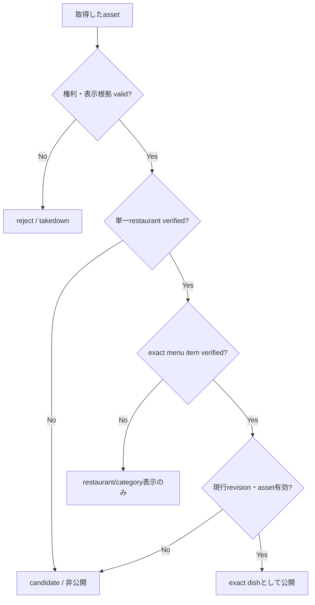

# `dish_media` 充足・誤紐付け防止戦略

調査日: 2026-08-10

対象: 日本の飲食店検索アプリにおける、実在する料理画像の収集、`restaurant_id` / `dish_id`への紐付け、商用表示、継続運用

関連: [Issue #843](https://github.com/Ayato-kosaka/nanitabeyo/issues/843)、[オープンデータPOC](./REPORT.md)、[比較Excel](./dish_media_strategy_2026-08-10.xlsx)

> 公開仕様・規約と現行コードを基にした技術・事業判断資料であり、個別案件の法律意見ではない。外部サービスを本番採用する前に、最新の契約、表示要件、保存制限、権利処理を法務・サービス提供者と確認する。

## 0. 結論

**Instagram公式oEmbedを`dish_media`の主取得手段にはしない。** 2026-06-15にtokenless oEmbedが再導入され、既知の公開投稿URLを公式embedとして表示する用途には有力である。しかし、oEmbedは画像取得APIでも投稿検索APIでもなく、次を保証しない。

- 投稿者が対象店舗の正当な管理者であること
- ブランド共通アカウントの投稿が対象支店に該当すること
- carousel、repost、collaboration投稿のどの料理が対象か
- 現行メニューの同一料理であること
- 画像を自社CDNへ保存・加工・再配布できる著作権上の許諾
- 投稿・アカウント・embed設定変更後も継続表示できること

したがってInstagramは、**ownerが対象支店と正確なmenu itemを選択・確認した場合だけ、詳細画面に外部embedとして表示する補助経路**にする。画像binaryを取得して現在の`dish_media.media_path`へ再保存しない。

実画像を無料のprovider feeで高精度に増やす優先順位は次の通りである。

1. **店舗owner・chain本部の直接upload / feed**: 支店とmenu itemを管理画面上で固定し、商用表示許諾を取得する。精度・権利・安定性の主軸。
2. **merchant OAuthによるPOS/catalog連携**: Square等の安定した商品IDと画像を取得し、ownerがlocation適用範囲と利用権限を確認する。
3. **署名付き料理QRからのUGC**: `restaurant_id`、`menu_item_id`、menu revisionをサーバー署名した導線で固定し、receipt/order証跡とmoderationを組み合わせる。
4. **owner確認済みInstagram oEmbed**: exact itemをownerが選択した投稿だけを外部表示する。直接画像coverageとは別指標にする。
5. **公式site / Schema.org / OCR / vision / LLM**: 候補発見とreject判定だけに使い、単独で公開確定しない。
6. **category placeholder**: UIの空欄回避にだけ使い、実料理写真coverageへ数えず「イメージ」と明示する。

**無料の公開情報だけで、日本の全店舗・全料理について「実画像」「正確な店舗・料理ID」「商用利用権」「永続性」を同時に100%保証するsourceは存在しない。** 100%にできるのは「不確実な画像を出さない」精度であり、実画像coverageはowner参加、UGC、個別契約、撮影のいずれかで増やす必要がある。API利用料が0円でも、storage、moderation、権利確認、owner獲得、削除対応の運用費は0円ではない。

## 1. まず「充足」を4つに分ける

placeholderを実画像として数えると、数字は100%でもユーザー価値と安全性を測れない。次のKPIを分離する。

| KPI | 分子 | 分母 | 用途 |
|---|---|---|---|
| `exact_owned_coverage` | owner/UGC/POS由来で、exact menu itemと権利がverifiedの自社配信画像 | active menu items | 最重要の実画像coverage |
| `exact_embed_coverage` | owner確認済みexact menu itemの有効な外部embed | active menu items | 外部依存の補助coverage |
| `restaurant_category_coverage` | 店舗はverifiedだが料理カテゴリまでの画像 | active restaurant × category | 発見UIの補助。exact dishとは表示しない |
| `nonblank_display_coverage` | 上記とplaceholderを含む非空表示 | 表示対象 | UI品質。実画像coverageとは別物 |

目標は短期的に`nonblank_display_coverage = 100%`、中長期的に`exact_owned_coverage`を増やすことである。exact判定できない画像を無理に`dish_id`へ付けてcoverageを上げない。

## 2. 現行実装の監査結果

### 2.1 現在の`dishes`はexact menu itemではない

[Prisma schema](../../../shared/prisma/schema.prisma)の`dishes`は`restaurant_id`と`category_id`の組をuniqueにしている。これは「この店舗のラーメンカテゴリ」のようなrestaurant-category entityであり、「醤油ラーメン 980円」のような個別商品ではない。`name`もnullableである。

[ReviewForm](../../../app-expo/features/map/components/ReviewForm.tsx)も、利用者にrestaurantとdish categoryを選ばせて`/v1/dishes`へ送る。restaurantの取り違えを抑える良い導線だが、exact itemまでは証明しない。

したがって、現在の`dish_id`に付いた画像を「個別メニュー料理の写真」と断定してはいけない。まず次を分離する。

- 現行`dishes`: `restaurant_dish_categories`相当として互換維持
- 新規`menu_items`: 店舗内のexact item。owner/POSのstable item IDを保持
- `menu_item_revisions`: 名前、価格、期間、販売終了等の版管理

### 2.2 Google bulk importは致命的な誤紐付けを作り得る

[dishes.service.ts](../../../api/src/v1/dishes/dishes.service.ts)の`bulkImportFromGoogle`は、料理カテゴリ名でPlacesを検索し、contextual photoがなければ`place.photos`へfallbackする。その画像をカテゴリ名の`dish`へ付け、place-level reviewも`dish_reviews`へ付けている。

このfallbackには次の意味上の飛躍がある。

```text
Google検索に店舗が返る
  ≠ place photoが検索料理を写している
  ≠ place reviewが検索料理を論評している
  ≠ exact menu itemが特定できた
```

さらに[create-dish-media-entry.service.ts](../../../api/src/internal/dishes/create-dish-media-entry.service.ts)はphoto URLをfetchし、storageへuploadしている。現行[Google Maps Platform Terms](https://cloud.google.com/maps-platform/terms)は、許可された場合を除くMaps Contentのprefetch、index、storage、reshare、rehostやreviewのcopy/save等を制限する。[Place Photos](https://developers.google.com/maps/documentation/places/web-service/place-photos)もphoto nameをcacheできず期限切れになり得ると明記する。

**P0推奨**:

- Google bulk importから新規`dish_media` / `dish_reviews`を公開生成する処理を停止する
- 既存Google import行をprovenanceで抽出し、exact dish面では非表示または`candidate`へ降格する
- Google Placesは必要なユーザー操作中のlive参照に限定し、画像masterにしない
- 規約・権利・削除追随を確認できるまで、既存binaryの再配信を継続しない

### 2.3 `dish_media`に公開判断の証拠がない

現行`dish_media`は`dish_id`、`media_path`、`thumbnail_path`、`media_type`等を持つが、provider、source URL、license、rights holder、attribution、restaurant/dish照合証拠、外部embed、availability、takedown状態を表現できない。候補と公開済みも同じtableである。

これを維持したままsourceを増やすと、後から「なぜこの店・料理へ出してよいか」を監査できない。binary、外部表示、placeholderと、entityへのclaimを分離する必要がある。

## 3. 候補手段の比較

`無料`はprovider/API利用料の意味で評価し、人件費・storage・moderationは別に扱う。`exact`は個別menu itemへの直接キーまたはowner確認がある場合だけ○とする。

| 手段 | 支店exact | 料理exact | 商用表示・権利 | provider fee | 自社rehost | coverage潜在力 | 判断 |
|---|---:|---:|---|---:|---:|---:|---|
| owner直接upload | ○ | ○ | 規約で明示許諾を取得可能 | 無料 | ○ | 中〜高 | **主軸** |
| chain本部feed | ○ | ○ | 本部の権利保証と支店scopeが必要 | 無料〜契約 | ○ | 非常に高 | **最優先営業** |
| Square Catalog OAuth | ○ | ○ | merchant承認。画像権利・保存条件を確認 | API無料 | 条件確認 | 導入店内で高 | **POC推奨** |
| Google Business Profile FoodMenus/Media | ○ | ○になり得る | owner OAuthだが保存・用途制限が強い | API無料 | 原則master化しない | 導入店内で中 | live確認/補助 |
| Instagram URL + oEmbed | owner確認時○ | owner確認時○ | embedは権利移転でない。provider条件に従う | tokenless無料 | × | 中 | **外部embed補助** |
| Instagram professional OAuth | account○、支店は要確認 | owner選択時○ | App Review/権限、embedと権利確認 | API無料 | 原則× | 中 | owner投稿の発見補助 |
| 署名付き料理QR UGC | ○ | ○ | 投稿規約・moderation・削除対応 | 無料 | ○ | 高 | **主軸候補** |
| 通常のapp UGC | 選択時○ | categoryまでが多い | 投稿規約・moderation | 無料 | ○ | 高 | category補助 |
| 公式site Schema.org/画像候補 | domain○、支店は要確認 | metadata次第 | 公開URLは商用複製許諾ではない | 無料 | owner許諾後のみ | 中 | candidateのみ |
| Wikimedia Commons | metadata次第 | 稀 | asset別license・attribution・SA条件 | 無料 | 条件付き○ | 極低 | 例外的補完 |
| Hot Pepper API | ○ | ×（店舗top photo） | credit/cache/事業条件に従う | 無料 | master化不可 | 店舗levelで高 | exact dishには不採用 |
| Google Places Photo live | ○ | × | Maps規約、attribution、保存制限 | 有料枠/課金 | × | 店舗levelで高 | exact dishには不採用 |
| Google Maps/口コミsite/social crawl | 推定 | 推定 | 規約・著作権・削除追随risk | 実装上無料 | × | 見かけ上高 | **No-Go** |
| stock/生成画像/category画像 | × | × | license次第 | 条件次第 | ○ | 100% | placeholderのみ |

完全版は[比較Excel](./dish_media_strategy_2026-08-10.xlsx)に、採用条件、失敗例、POC項目、一次資料を含めている。

## 4. Instagram oEmbedの精査

### 4.1 2026年時点でできること

[Metaの2026-06-15発表](https://developers.facebook.com/blog/post/2026/06/15/tokenless-access-to-meta-oembed-apis/)により、公開Instagram URLのtokenless oEmbedが再導入された。tokenlessはendpointごとに1時間1,000 requestで、token利用時はより高いlimitを利用できる場合がある。[Instagram oEmbed docs](https://developers.facebook.com/documentation/instagram-platform/oembed)へ既知のcontent URLを渡し、providerが生成したHTMLを取得して表示する。

これは次には適する。

- ownerが管理画面に貼った特定post/reelを、Metaの表示機構のまま詳細画面へ出す
- 画像binaryを自社で複製せず、provider側の削除・privacy変更を反映する
- 初期POCをprovider fee 0円で始める

### 4.2 できないこと

- oEmbedはrestaurant accountやpostを探すsearch/list APIではない。**post URLを別経路で知る必要がある**
- [2025年の移行](https://developers.facebook.com/documentation/instagram-platform/changelog)後、`author_name`、`author_url`、`thumbnail_url`等は従来どおり返らない。oEmbed responseだけで投稿者本人や安全なthumbnailを検証できない
- private、inactive、age-restricted、embed無効accountは対象外で、Storiesも対象外。[Instagram Help](https://help.instagram.com/620154495870484/)にある公開post/reel等だけが対象で、account ownerは[embedを無効化](https://help.instagram.com/252460186989212/)できる
- HTML widgetであり、一覧card用の安定した画像URLではない。Expo/React NativeではWebView、CSP、cookie/同意、性能、accessibilityを別途検証する必要がある
- oEmbedの利用は画像著作権の移転や、自社CDNへのrehost許諾を意味しない

### 4.3 安全な採用flow

1. restaurant ownerをdomain、電話、Google Business Profile OAuth、POS OAuth等で確認する。
2. ownerが**単一支店**を選ぶ。ブランド共通accountだから全支店に適用、とはしない。
3. ownerが現行のexact `menu_item`とrevisionを選ぶ。
4. ownerがInstagram URLを貼る、またはprofessional account連携後の自分の投稿から選ぶ。
5. systemはofficial oEmbedで有効性だけ検査する。HTMLをscrapeして画像URLを抽出しない。
6. ownerが「この支店で提供するこの料理を表す」「表示権限を有する」「必要な第三者許諾を得た」を確認する。
7. `external_embed`として保存し、一覧thumbnailではなく詳細画面にprovider badge付きで表示する。
8. 定期availability checkで404/private/embed disabledを検知し、直ちに非表示にする。

Instagram accountがcorporate、複数支店、delivery brand、popupを含む場合、単一支店のhard evidenceがない限り`restaurant_claim = candidate`のままにする。caption、hashtag、geotag、OCR、vision、LLM一致だけで公開しない。

### 4.4 carousel / repost / collaboration

| ケース | 公開ルール |
|---|---|
| 1投稿に複数料理 | `relation = multiple_items`。単一dish heroにしない。ownerが対象itemを明示してもembed全体には他料理が写ると表示 |
| 他accountからのrepost | 元撮影者・投稿者の権利確認がない限りcandidate |
| collaboration投稿 | collaboratorであることは支店・dishの証明にならない。owner確認を要求 |
| chain共通画像 | `brand_media`として支店scopeを契約で列挙。「この店舗で撮影」と表示しない |
| 過去/季節限定menu | `menu_item_revision`と提供期間へ結び、終了後はarchive |

## 5. 最も現実的な「無料」充足architecture

### 5.1 owner直接uploadをdefaultにする

restaurant claim完了時に、店舗情報入力より先に代表的な5〜10 menu itemと画像を登録してもらう。upload画面ではrestaurantをsessionから固定し、ownerがmenu itemを作成・選択する。自由入力したrestaurant名から自動matchしない。

owner規約で少なくとも次を明示する。

- uploaderが権利者である、または商用表示・加工・thumbnail生成を許諾できる
- appへの非独占的、地域・媒体を含む利用許諾
- 人物、第三者著作物、商標、個人情報の処理
- menu終了、店舗閉店、権利異議時の削除
- chain本部の場合に許諾対象となる法人、brand、支店、期間

### 5.2 chain本部feedをcoverage acceleratorにする

全国coverageを最短で増やすには個店crawlよりchain本部とのCSV/API/SFTP連携が効く。`brand_id`だけで全支店へ複製せず、feed側のlocation codeと自社`restaurant_id`をowner確認済みmapping tableで結ぶ。

画像scopeを区別する。

- `exact_location_item`: 当該支店・商品に適用
- `brand_all_locations_item`: 契約上全支店に適用する商品イメージ
- `location_set_item`: 対象支店集合が明示
- `brand_marketing_only`: menu itemの実写真としては不使用

### 5.3 POS/catalog OAuth

[Square Catalog API](https://developer.squareup.com/reference/square/catalog-api)はitem、variation、category、imageをstable catalog object IDで扱い、[OAuth](https://developer.squareup.com/docs/oauth-api/overview)でsellerがappを認可できる。[Squareの画像管理](https://developer.squareup.com/docs/catalog-api/manage-images)では画像IDをcatalog objectへ関連付けるため、caption推定より料理exact性が高い。日本向けAPIは[online payment API案内](https://developer.squareup.com/jp/ja/online-payment-apis)上、API/SDK自体を無料で開始できる。

ただしcatalog itemが全locationで販売されるとは限らない。seller location、item presence、availability、variation、画像の利用権を確認し、ownerに対象支店を最終確認させる。providerから取得できることと、自社CDNへ永続再配布できることは別なので、契約確認またはownerから同じ原本を直接uploadしてもらう。

### 5.4 Google Business Profileはowner/location検証とlive補助

[Business Profile Media](https://developers.google.com/my-business/reference/rest/v4/accounts.locations.media)は管理対象locationに紐づき、`FOOD_AND_DRINK`、`MENU`や`priceListItemId`を扱う。[FoodMenus](https://developers.google.com/my-business/reference/rpc/google.mybusiness.v4)にはsection、item、価格、allergen、dietary、`media_keys`等があるため、owner/location/itemの確認情報として強い。[利用料金](https://developers.google.com/my-business/content/pricing)は登録利用者に課されない。

一方、[Business Profile API policies](https://developers.google.com/my-business/content/policies)は認可されたlisting管理用途を前提にし、cache/storageやaggregationを制限する。したがって全国media masterとして吸い上げず、merchant onboarding中のidentity検証、ownerが管理するlive view、またはownerから原本・許諾を別途取得する導線に使う。

### 5.5 署名付き料理QR UGC

通常の「店を検索して料理カテゴリを選ぶ」投稿より、menu/卓上/receipt上のQRから開始する方が誤紐付けを構造的に減らせる。

```text
payload = restaurant_id + menu_item_id + menu_revision_id + expires_at + nonce
signature = HMAC(server_secret, payload)
```

- appは署名検証後にrestaurantとmenu itemをread-onlyで固定する
- order/receipt code、撮影時刻、短いupload期限を追加証拠にする
- GPS/EXIFは補助信号に留める。位置情報だけで確定しない
- QRのコピー・SNS転載対策としてnonce、一回性、店内Wi-Fi/注文session等を組み合わせる
- moderationでfood以外、人物、menu表、他画面の転載、low qualityを除外する
- 初回投稿や矛盾時はowner確認または複数独立UGCのconsensusを要求する

## 6. 誤紐付けを公開しないhard gate

accuracyはAI scoreを上げるだけでは保証できない。**hard evidenceがなければabstainし、candidateのまま公開しない**ことで保証する。



### 6.1 restaurant hard evidence

次のいずれかを必須にする。

- verified owner sessionで対象restaurantを選択して直接upload
- chain本部が署名/認証済みlocation codeで指定
- POS seller OAuthのlocationとowner確認済みmapping
- Google Business Profile OAuthのmanaged locationとowner確認済みmapping
- server署名済みdish QRにrestaurant IDが含まれる

名称類似、100m geofence、電話、official URL、Instagram profile、geotagは候補生成・矛盾検知には使えるが、単独でpublish evidenceにしない。mall内の同名店、shared kitchen、移転、間借り、delivery brandがあるためである。

### 6.2 dish hard evidence

次のいずれかを必須にする。

- owner/HQがexact menu itemとrevisionを選択
- POS/catalogのstable item IDをowner確認済みmappingへ結合
- signed QRにmenu itemとrevisionが含まれる
- ownerがInstagram/公式site候補をexact itemへ明示的に承認

caption/OCR/vision/LLMだけの一致、Google contextual photo、review内の料理名はhard evidenceにしない。AIは「明らかに違う」「複数料理」「文字とitem名が矛盾」「別店logo」のreject/triageに使う。

### 6.3 rights hard evidence

binaryを自社配信する場合は、次を100%保持する。

- `rights_basis`: owner_upload / ugc_terms / direct_license / open_license
- `rights_holder`、uploader、source URL、取得日時
- license version / contract ID / consent proof
- commercial use、resize/crop、thumbnail、保存、再配信の可否
- attribution text / URL / share-alike等の条件
- expiration / revocation / takedown状態

外部embed/live componentは`provider_terms`を根拠に別typeで扱い、画像binaryの権利を得たとは記録しない。

### 6.4 database invariants

- public exact dish queryは、`asset active`、`rights valid`、`restaurant claim verified`、`menu item claim verified`、`revision active`をすべて要求
- `menu_item.restaurant_id`とrestaurant claimのIDが一致しなければtransactionを失敗
- chain scopeは単一支店、全支店、明示した支店集合のどれかを必須化。nullを「全店」と解釈しない
- candidateとpublishedを別stateにし、numeric confidenceだけでpublishedへ遷移させない
- 同一/pHash近似画像が別restaurantへ現れたらblock。ただし契約済みchain assetは明示scopeで例外化
- menu itemの置換・名称流用を防ぐためrevisionへclaimし、販売終了後に自動archive
- reviewer、判断根拠、state遷移をappend-only audit logに残す
- asset/provider削除、権利失効、店舗閉店時にpublic viewから即時除外するcascadeを持つ

## 7. 推奨データモデル

現在の`dish_media`へ全sourceを押し込まず、assetとclaimを分離する。

```sql
menu_items (
  id uuid primary key,
  restaurant_id uuid not null,
  source_kind text not null,       -- owner, square, chain_feed, ugc
  source_item_id text,
  status text not null,
  unique (restaurant_id, source_kind, source_item_id)
);

menu_item_revisions (
  id uuid primary key,
  menu_item_id uuid not null,
  name text not null,
  valid_from timestamptz,
  valid_to timestamptz,
  owner_verified_at timestamptz
);

media_assets (
  id uuid primary key,
  asset_kind text not null,        -- owned_image, external_embed, external_live, placeholder
  provider text not null,
  provider_asset_id text,
  canonical_url text,
  storage_path text,
  sha256 text,
  phash text,
  status text not null,            -- candidate, active, unavailable, rejected, removed
  rights_basis text,
  rights_holder text,
  license_id text,
  license_proof_uri text,
  attribution text,
  rights_expires_at timestamptz,
  last_checked_at timestamptz
);

media_restaurant_claims (
  asset_id uuid not null,
  restaurant_id uuid not null,
  scope text not null,             -- exact_location, location_set, brand_all_locations
  status text not null,            -- candidate, verified, rejected
  evidence_type text not null,
  verified_by uuid,
  verified_at timestamptz,
  primary key (asset_id, restaurant_id)
);

media_menu_item_claims (
  asset_id uuid not null,
  menu_item_id uuid not null,
  menu_item_revision_id uuid,
  relation text not null,          -- exact_item, multiple_items, category_only, illustrative
  status text not null,
  evidence_type text not null,
  verified_by uuid,
  verified_at timestamptz,
  primary key (asset_id, menu_item_id)
);

external_embeds (
  media_asset_id uuid primary key,
  provider text not null,
  canonical_content_url text not null,
  render_mode text not null,
  provider_status text not null,
  last_http_status integer,
  next_check_at timestamptz
);

media_audit_events (
  id uuid primary key,
  media_asset_id uuid not null,
  actor_id uuid,
  event_type text not null,
  evidence jsonb,
  created_at timestamptz not null
);
```

`external_embed`を現在の`media_path`へ文字列として混在させない。公開APIではdisplay resolverがowned image、external embed、category image、placeholderをunionし、typeごとに専用rendererを返す。

## 8. 表示resolverとユーザーへのラベル

exact dish画面の優先順位:

1. verified exact owned image
2. owner-confirmed exact external embed/live component
3. verified restaurant-category UGC（「この店舗の○○カテゴリ投稿」）
4. category placeholder（「イメージ」）

1と2だけをexact coverageへ数える。3を料理名のhero画像に見せず、4を店舗で提供された実物のように見せない。chain本部の共通画像には「ブランド提供イメージ」、外部embedにはprovider badge、UGCには投稿者/撮影時期を表示する。

一覧・map cardは高速で安定したowned thumbnailかplaceholderを使う。Instagram widgetはdetailへ遅延loadし、失敗時にlayoutが崩れないfallbackを持つ。tracking/cookie同意、WebView、アクセシビリティ、CSPをPOCで確認する。

## 9. POC計画

### Phase 0: 安全化

- Google bulk import由来media/reviewをinventory化し、新規公開生成を停止
- source不明の既存mediaを`unknown_provenance`としてexact dish面から隔離
- current `dish_id`はcategory scopeであることをAPI/UIに明示

### Phase 1: schemaとowner upload

- `menu_items` / revisions / assets / claims / audit logを追加
- owner claim + exact item選択 + rights consent + direct uploadを実装
- public hard gate、takedown、revision終了をtest

### Phase 2: 無料connector比較

| cohort | 目安 | 検証内容 |
|---|---:|---|
| owner upload | 10店舗・100item | 登録時間、権利同意、thumbnail品質、継続率 |
| Square OAuth | 5〜10店舗 | location/item/image mapping、権利・保存、差分sync |
| Instagram manual URL/oEmbed | 10店舗・100post | 支店/item owner確認、carousel、削除、WebView性能 |
| signed QR UGC | 10店舗・300投稿 | QR転送、不正投稿、receipt proof、moderation工数 |
| chain feed | 1社・100店舗以上 | location code、全店/限定scope、menu revision、削除cascade |

### Phase 3: adversarial gold set

happy pathだけでなく、次を必ず含める。

- 同名店、chain複数支店、mall、駅ビル、shared kitchen、間借り
- delivery-only brand、popup、移転、閉店、業態変更
- repost、collaboration、corporate Instagram、carousel、複数料理
- 季節限定、売切れ、同名別商品、menu刷新、過去投稿
- chain共通写真、別支店撮影、stock photo、生成画像、透かし転載

### 合格指標

| 指標 | gate |
|---|---:|
| 他restaurantへの誤紐付け | public setで0件。1件でもrelease block |
| exact dish precision | 99.9%以上を目標。推定だけでなくhard evidence必須 |
| rights metadata completeness | public owned assetsの100% |
| restaurant + dish claim | public exact assetsの100% verified |
| unavailable/takedown | 検知後直ちにpublic resolverから除外 |
| candidate auto-publish | 0件 |
| coverage | `exact_owned` / `exact_embed` / `category` / `placeholder`を別々に報告 |

誤率0.1%未満を95%水準で監査上主張するには、単純な「0件だった」だけでなく相応の標本が必要である。rule of threeの近似では0 errorで約3,000件を監査すると上側限界が約0.1%になる。edge caseを層化し、最終的には継続monitoringと1件即blockを組み合わせる。

## 10. Go / Conditional / No-Go

### Go

- owner/HQ direct uploadと明示的commercial display license
- exact item IDを持つPOS/catalog connector + owner確認
- signed dish QR UGC + moderation
- category placeholderによる非空UI。実画像とは別集計
- pHash/OCR/vision/LLMをreject・重複検知・human review優先度付けに使用

### Conditional

- Instagram oEmbed: ownerが支店・exact itemを選択した外部embedのみ
- Instagram professional API: owner自身の投稿発見用。支店/itemの自動確定は禁止
- Google Business Profile: owner/location検証と規約準拠live用途
- 公式site/Schema.org: candidate発見。owner/license承認後のみbinary ingest
- Wikimedia Commons: asset単位のlicense、attribution、share-alikeを満たす場合のみ

### No-Go

- Instagram hashtag、caption、geotag、visionだけでrestaurant/dishを自動publish
- corporate accountの投稿を全支店へ暗黙複製
- Google contextual/place photoを検索カテゴリの料理写真として保存・公開
- Google Maps、Tabelog、SNS、公式site画像の無許諾crawl/rehost
- crawler取得画像をLLM加工・crop・再encodeすれば自社権利になるという設計
- source不明画像をcoverageのためにexact dishへ付ける

## 11. 実装優先順位

| 優先 | 実施 | 理由 |
|---|---|---|
| P0 | Google importの新規media/review公開停止、既存provenance監査 | 現行で他料理・他用途写真と規約riskを同時に抱える |
| P0 | candidate/publicの分離とhard gate | source追加前に事故経路を閉じる |
| P1 | exact `menu_items` + revisions | current `dish_id`ではexact mappingを表現できない |
| P1 | owner claim、direct upload、rights consent | 最も精度・権利・安定性が高い |
| P1 | Instagram external embed model | rehostせず短期に補助coverageを増やせる |
| P2 | signed QR UGC | 個店のlong tailを無料provider feeで増やせる |
| P2 | Square connector | stable item IDで高精度に拡張できる |
| P2 | chain HQ feed | 全国coverageへの最大lever |
| P3 | GBP/Instagram professional connector | owner onboardingと候補発見を改善 |
| P3 | 個別partner license / 委託撮影 | 参加しない店舗のgapを埋める |

## 12. 一次資料

### Meta / Instagram

- [Tokenless Access to Meta oEmbed APIs, 2026-06-15](https://developers.facebook.com/blog/post/2026/06/15/tokenless-access-to-meta-oembed-apis/)
- [Instagram oEmbed](https://developers.facebook.com/documentation/instagram-platform/oembed)
- [Instagram Platform Changelog](https://developers.facebook.com/documentation/instagram-platform/changelog)
- [Meta oEmbed Read](https://developers.facebook.com/docs/features-reference/meta-oembed-read/)
- [Instagram API with Instagram Login](https://developers.facebook.com/documentation/instagram-platform/instagram-api-with-instagram-login)
- [Instagram Help: embed public profile/content](https://help.instagram.com/620154495870484/)
- [Instagram Help: turn embeds off](https://help.instagram.com/252460186989212/)

### Merchant/POS

- [Square Catalog API](https://developer.squareup.com/reference/square/catalog-api)
- [Square OAuth](https://developer.squareup.com/docs/oauth-api/overview)
- [Square: manage catalog images](https://developer.squareup.com/docs/catalog-api/manage-images)
- [Google Business Profile media](https://developers.google.com/my-business/reference/rest/v4/accounts.locations.media)
- [Google Business Profile v4 / FoodMenus](https://developers.google.com/my-business/reference/rpc/google.mybusiness.v4)
- [Business Profile API pricing](https://developers.google.com/my-business/content/pricing)
- [Business Profile API policies](https://developers.google.com/my-business/content/policies)

### 公式site・open license

- [Schema.org MenuItem](https://schema.org/MenuItem)
- [Schema.org Menu](https://schema.org/Menu)
- [Schema.org Restaurant](https://schema.org/Restaurant)
- [Wikimedia Commons: Reusing content](https://commons.wikimedia.org/wiki/Commons:Reusing_content_outside_Wikimedia)
- [Wikimedia Commons: Licensing](https://commons.wikimedia.org/wiki/Commons:Licensing)

### Google / その他媒体

- [Google Maps Platform Terms](https://cloud.google.com/maps-platform/terms)
- [Google Maps Service Specific Terms](https://cloud.google.com/maps-platform/terms/maps-service-terms)
- [Place Photos](https://developers.google.com/maps/documentation/places/web-service/place-photos)
- [Hot Pepper API reference](https://webservice.recruit.co.jp/doc/hotpepper/reference.html)
- [Hot Pepper API利用案内](https://webservice.recruit.co.jp/doc/hotpepper/guideline.html)
- [Recruit Web Service利用規約](https://webservice.recruit.co.jp/regulation.html)
